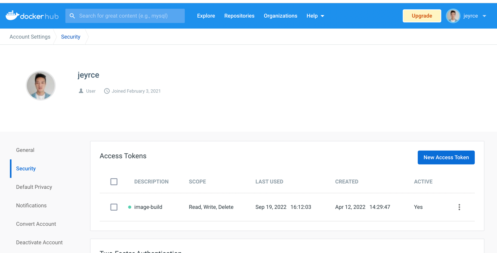
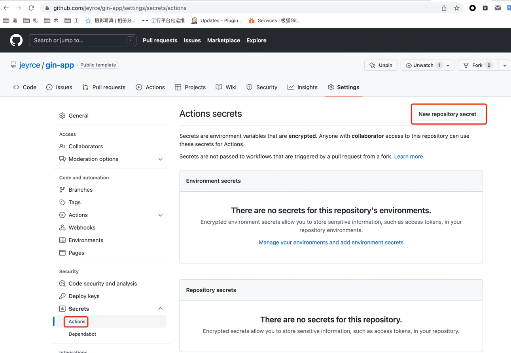

### 模板特点

模板集成了一个基于 [gin](https://github.com/gin-gonic/gin) 的后端项目通常需要使用的基础框架，具体有:

- 集成 [pflag](https://github.com/spf13/pflag) + [viper](https://github.com/spf13/viper) 统一配置管理，同时支持命令行参数
- 集成 [gorm](https://gorm.io/) ORM 框架, 默认 MySQL 连接
- 基于 [cron](https://github.com/robfig/cron/v3) 的定时任务框架
- 预置中间件和api版本管理，基于 [gin-swagger](https://github.com/swaggo/gin-swagger) 的api文档
- 内置 Dockerfile + Makefile 镜像、二进制构建
- 基于 `github-workflow` 的自动镜像构建

### 使用方法

> 初始化过程**仅支持MacOS和Linux**, 其他系统请参考 `init.sh` 自行手动修改。

- 1、在 `github` 页面创建仓库选择使用该模板

- 2、在本地初始化项目

```shell
git clone <你从模板创建的仓库>

cd <项目下>

make init # 按提示输入一个module

# 下载依赖开始开发
go mod download
```

- 3、开发业务逻辑

### 自动构建

> 基于 github-workflow 自动构建镜像推送到 docker仓库, 当前main分支推送和tag事件自动触发

- 1、创建 [docker](https://hub.docker.com) 密钥

Account Settings -> Security -> New Access Token, 权限选择 Read/Write



- 2、设置github项目

项目 -> Settings -> Secrets -> Actions -> New repository secret，创建两个键值对：

- `DOCKER_HUB_NAME` 值是docker用户名
- `DOCKER_HUB_TOKEN` 值是第一步创建的密钥



